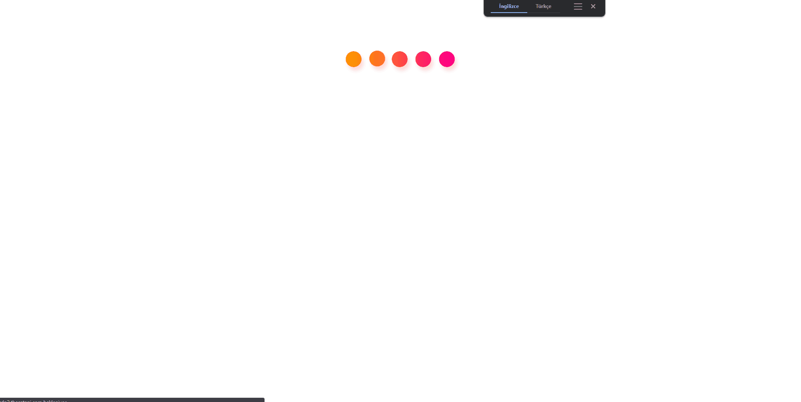
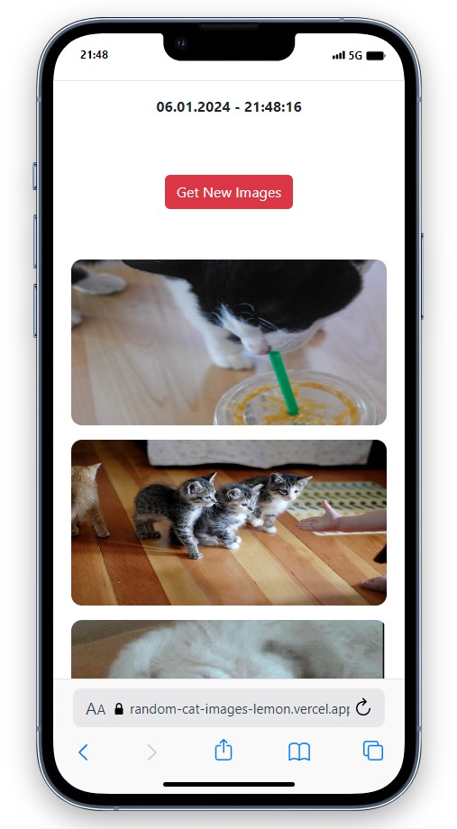
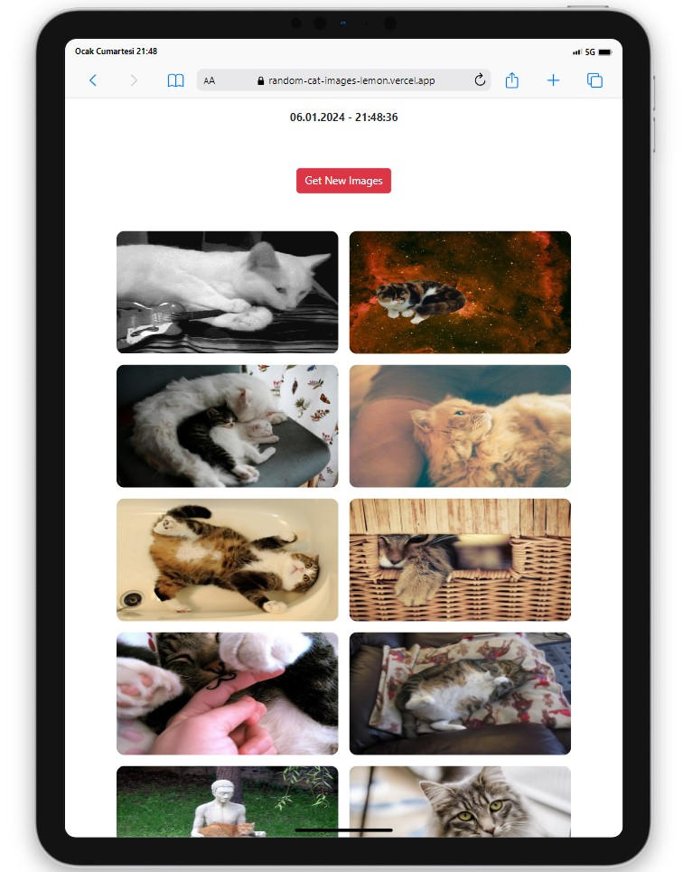
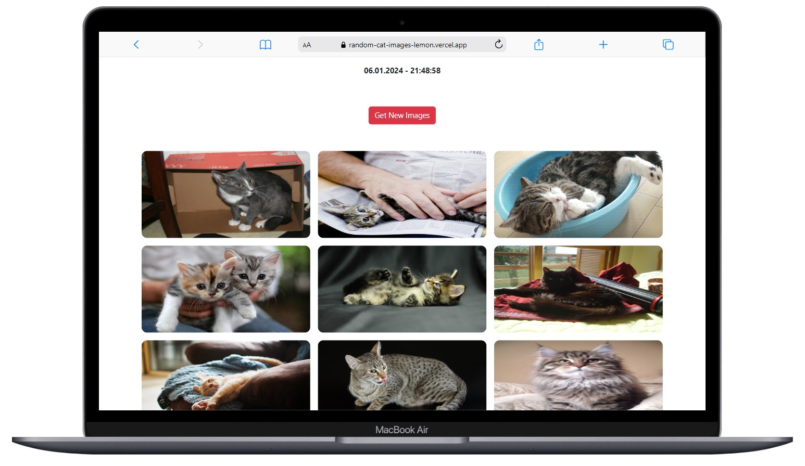

# Random Cat Images

  

## About the Project
A web application that fetches and displays random cat images using [The Cat API](https://thecatapi.com/). Users can click a button to get new images and the page displays the date and time when the images were retrieved.

## Table of Contents
- [Description](#description)
- [Features](#features)
- [Usage](#usage)
- [Screenshots](#screenshots)

## Description

This web application uses the Cat API to fetch random cat images. It provides a simple and fun way for users to view a variety of cat pictures. The page also displays the date and time when the images were retrieved.

## Features

- Fetches random cat images from [The Cat API](https://thecatapi.com/).
- Displays the date and time of the image retrieval.
- Allows users to get new cat images by clicking a button.

## Usage

1. Open the web page in a browser.
2. The loading screen will be displayed while fetching the initial set of cat images.
3. Once the images are loaded, the page will display the date and time.
4. Click the "Get New Images" button to fetch and display a new set of random cat images.
5. Hover over the images to see a subtle effect.
6. If there is an error in fetching the images, an error GIF will be displayed.

## Screenshots

  
  
  

## Compatibility

The project is compatible with both wide-screen computers and mobile devices.